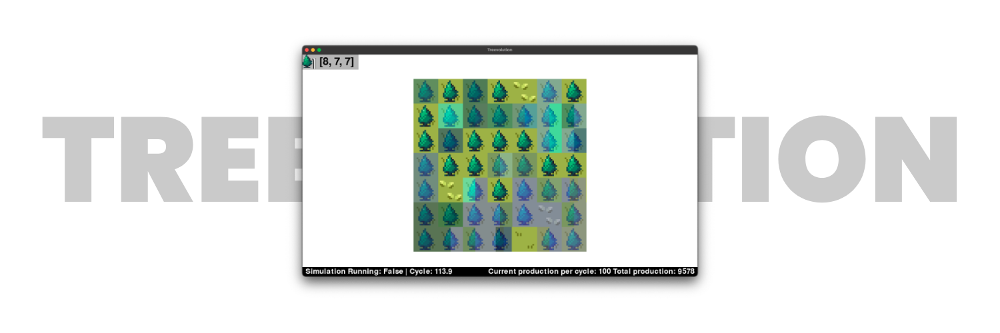
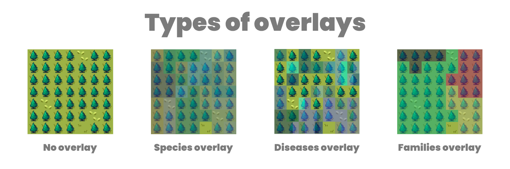

# Treevolution

Final project for the course "Modélisation et Optimisation de Systèmes Complexes" ("Modeling and Optimization of Complex Systems").



## About
This project aims at modeling a garden's ecosystem composed of fruit trees and diseases that propagate. 
It was developed in only two days. 

The goal is to find the best way to maximize production and minimize costs induced by replacing trees and placing walls.

_Note: The cost is not computed yet._

## How to install
To install Treevolution, begin by cloning this repo somewhere on your computer:
```shell
git clone https://github.com/hugopanel/mosc-project
```

Then move to the project's folder and install the dependencies.
```shell
cd mosc-project
pip install -r requirements.txt
```

That's it, you're ready to play! Now, start the game from `main.py`:
```shell
python main.py
```

## How to play

### Basic concept
The game allows you to place trees, diseases, and walls.
- Trees carry a DNA sequence composed of 3 characters. More about that later. A tree can carry multiple diseases at once and propagate them to nearby trees and walls. Trees produce fruits. The number of fruits a tree produces increases the "Total production" count. A tree can also drop seeds, creating more trees around it.
- A disease also carries a DNA sequence. Each code in this sequence cancels out the same code in the tree's DNA, causing further damage. The more the DNA of a disease matches that of the tree, the lower the probability that the tree will heal and get rid of the disease.
- A wall greatly reduces the risk of propagating a disease, but the risk still remains. It can be used to isolate parcels of trees. However, a tree produces no fruit.

Treevolution also simulates mutations. Each seed dropped by a tree has a chance of mutating and changing one of its DNA code for another, randomly.
Increasing mutations can be a great strategy to isolate diseases and prevent them from spreading!

### DNA codes
A DNA sequence is composed of a number of codes. 
Each family of codes has a special advantage for the tree, describe in the table below.
The number associated with the code is only a means of identifying it 
— code 3 does not lead to higher productivity than code 1.

| DNA Code | Family Name  | Effect                                                     |
|----------|--------------|------------------------------------------------------------|
| 0-2      | Productivity | Increases the productivity of a tree by X*.                |
| 3-5      | Growth       | Each cycle, a seed grows by X* units more.                 |
| 6-8      | Mutation     | Increases the chance of a tree's seed being mutated by X*. |
| 9-11     | Protection   | Reduces damage inflicted by diseases by X*.                |
| 12-14    | Health       | Increases maximum health by X*.                            |

*: value X can be modified in-game from the configuration screen or by editing the file `engine/config.py`.

### Overlays



Overlays are a way to quickly show information visually. When an overlay is enabled, tiles on the board are assigned a color depending on the state of the tile and the overlay selected.
Treevolution offers three overlays.

**Species overlay**<br/>
Each type of tree is assigned a different color. 
The color is computed from the three codes in the tree's DNA sequence.
This overlay is useful to see the different species and mutations present in the garden.

**Diseases overlay**<br/>
The trees are colored based on the diseases they are infected with.
The colors are computed from the disease's DNA sequence.
If the tree has multiple diseases at once, the tile is split into the number of diseases to show every corresponding color.

**Families overlay**<br/>
A color is attributed to each tree based on the coordinates of the greatest ancestor.
That way, all trees that are descendents of the same tree will have the same color.
This can be useful to trace the origin of mutations.

### Keys
Here are the keys you need to know in order to play.

_Note: Treevolution is designed for QWERTY keyboards!_

**Global:**
- BACKQUOTE (TILDA): Clear the board (resets the garden, cycle count and production counts).
- TABULATION: Opens the global configuration menu, allowing you to change the probabilities and simulation settings.
- P: Starts, pauses or resumes the simulation.

**Inventory:**
- 1-6: Selects the corresponding item in the inventory.
- SPACE: When a tree or disease is selected in the inventory, opens the customization menu to create your own trees and diseases.

**Overlays:**
- Q: Shows the garden with no overlay.
- W: Shows the "species" overlay.
- E: Shows the "diseases" overlay.
- R: Shows the "families" overlay.

**Menus:**
- UP/DOWN ARROWS: When in a menu, select the next or previous item.
- LEFT/RIGHT ARROWS: When in a menu, increase or decrease the value of the selected variable.
- ESCAPE: When in a menu, closes the menu without saving.
- ENTER: When in a menu, saves the current configuration and closes the menu. 

### Things to keep in mind

Many features could still be added to Treevolution, and there are some bugs in the current version.

Some entries are grayed out in the global configuration menu. These entries are locked and have no impact on the simulation at the moment.

## Credits
Tiles taken from:
- [Grass Tileset 16x16 by Bonsaiheldin](https://opengameart.org/content/grass-tileset-16x16) (opengameart.org)
- [Castle Brick [Connecting Tileset] [16x16] by KnoblePersona](https://opengameart.org/content/castle-brick-connecting-tileset-16x16) (opengameart.org)

Previous commits also included tiles from:
- [Purupuru Island Tileset by Spring Spring](https://opengameart.org/content/purupuru-island-tileset) (opengameart.org)